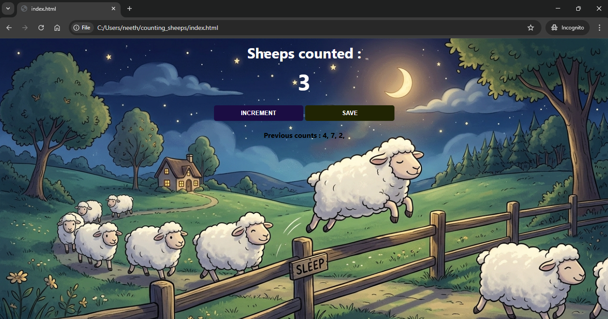

This repo contains code for a webpage for counting sheep written in html and javascript.
This fun website allows you to go to sleep by counting sheep. Just imaging sheeps in your mind and click increment button to count the sheeps one by one.
Save button allows you to log the current count and reset the counter. Sweet dreams :)

Sample image of webpage :

